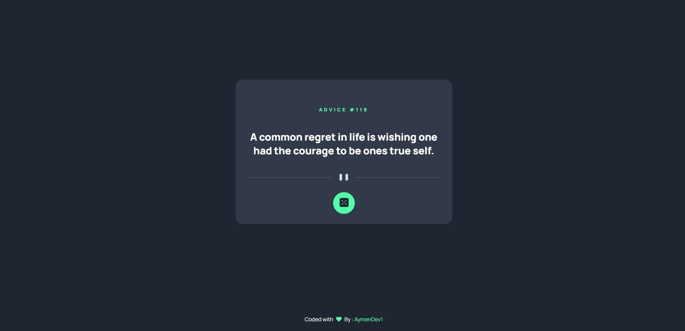

# Frontend Mentor - Advice generator app solution

This is a solution to the [Advice generator app challenge on Frontend Mentor](https://www.frontendmentor.io/challenges/advice-generator-app-QdUG-13db). Frontend Mentor challenges help you improve your coding skills by building realistic projects.

## Table of contents

- [Overview](#overview)
  - [The challenge](#the-challenge)
  - [Screenshot](#screenshot)
  - [Links](#links)
- [My process](#my-process)
  - [Built with](#built-with)
  - [What I learned](#what-i-learned)
  - [Continued development](#continued-development)
  - [Useful resources](#useful-resources)
- [Author](#author)
- [Acknowledgments](#acknowledgments)

## Overview

### The challenge

Users should be able to:

- Get A Random Advice / Quote Whenever he Click on the Dice Button or Refresh The Page

### Screenshot

### Links

- Solution URL: [https://github.com/aymendev1/AdviceApp](https://github.com/aymendev1/AdviceApp)
- Live Site URL: [https://adiveapp-aymendev1.netlify.app/](https://adiveapp-aymendev1.netlify.app/)

### Built with

- Semantic HTML5 markup
- CSS custom properties
- Flexbox
- JavaScript
- [FontAwesome](https://fontawesome.com/) - Icons Library
- [Advice API](https://api.adviceslip.com/) - API Generate Advices
- [Animsta ](https://animista.net/) - For Css Animations
